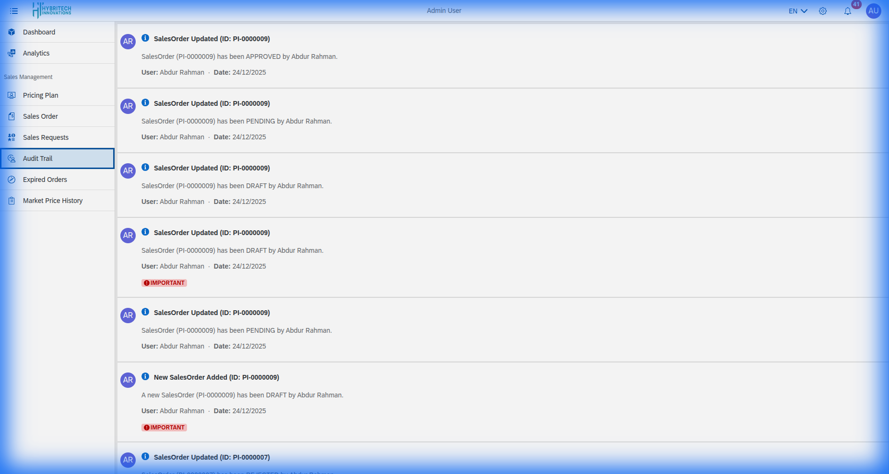

# Audit Trail

The **Audit Trail** ensures transparency and accountability within the Sales Management module.

## What is Tracked?
Every significant action taken within the system is recorded, including:
*   **User Actions**: Who logged in, who created an order, or who modified a price.
*   **Timestamp**: The exact date and time the action occurred.
*   **Details**: Before and after values for data modifications.

## Searching the Logs
Use the search functionality to filter logs by:
*   User ID
*   Action Type
*   Date Range

