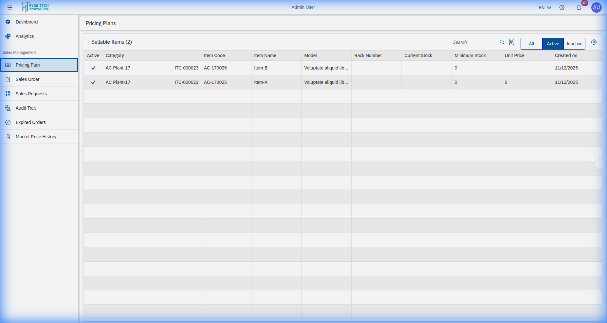

# Pricing Plan

The **Pricing Plan** section allows you to define and manage various pricing tiers for your products or services.

## Features
*   **Create Tier**: Set up new pricing tiers (e.g., Basic, Premium, Enterprise).
*   **Manage Rates**: Adjust rates based on market conditions or specific client agreements.
*   **Discount Rules**: Apply specific discount rules to different plans.

