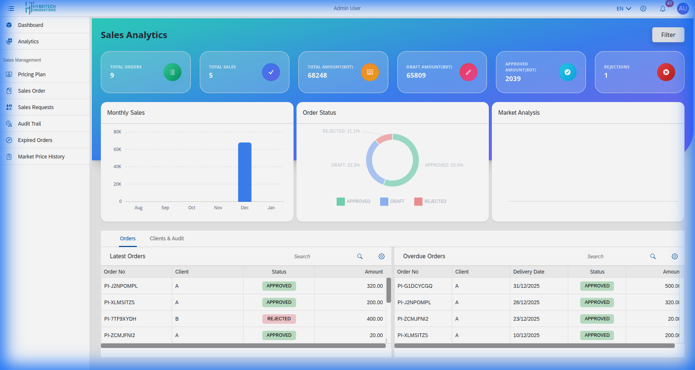
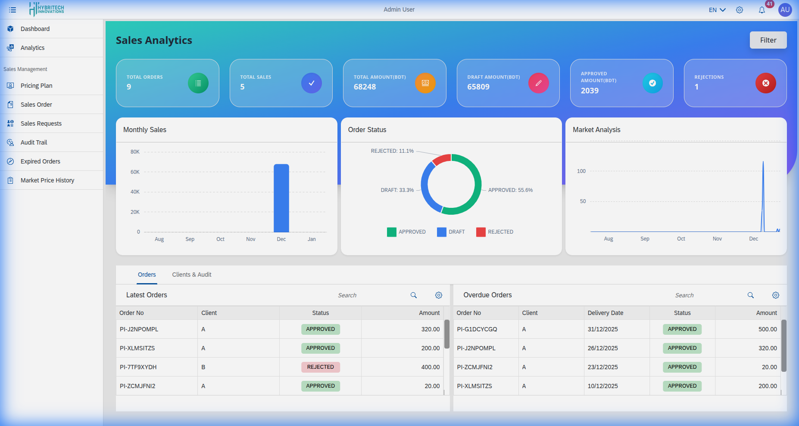

# Sales Analytics

The **Sales Analytics** dashboard is the central hub for monitoring your sales performance and commercial activities. It provides real-time insights through interactive charts and key performance indicators (KPIs).

## Dashboard Overview

The dashboard is divided into several key sections:

### 1. Key Metrics Cards
At the top of the page, you will find summary cards providing instant snapshots of critical data:
*   **Total Orders**: The total number of orders received.
*   **Total Sales**: The cumulative monetary value of all sales.
*   **Total Production**: Links sales data with production output.
*   **Production Costs**: Overview of costs associated with goods sold.

### 2. Analytical Charts
*   **Monthly Sales**: A bar or line chart visualizing sales trends over the months, helping you identify peak seasons and performance dips.
*   **Order Status**: A breakdown (e.g., pie chart) showing the proportion of orders in different states (Pending, Completed, Cancelled).
*   **Market Analysis**: Graphical representation of market trends and price fluctuations.

### 3. Integrated Tabs
The dashboard includes tabs for quick access to related detailed views:
*   **Orders**: View lists of **Latest Orders** and **Overdue Orders** requiring immediate attention.
*   **Clients & Audit**: A combined view to manage client relationships and review the latest audit logs.

