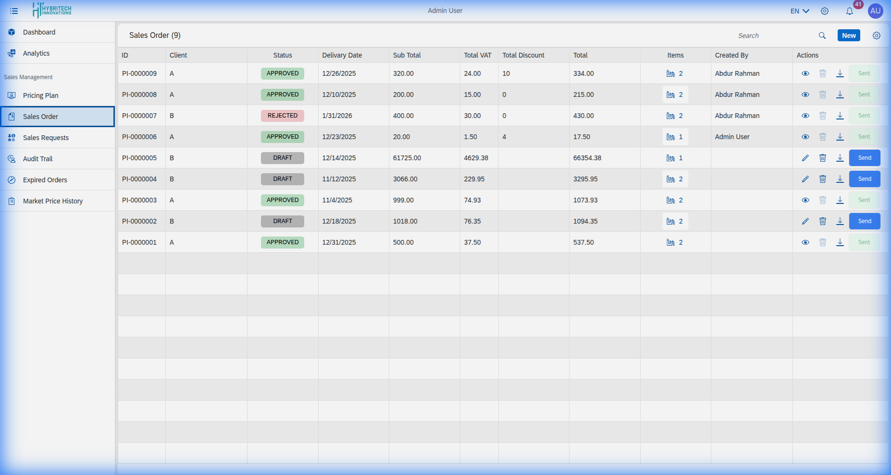

# Sales Order

The **Sales Order** module is the primary workspace for processing customer orders.

## Managing Orders
This section allows sales representatives to:
*   **Create New Orders**: Input client details, select products, and generate a new sales order.
*   **Track Status**: Monitor the progress of an order from 'Pending' to 'Delivered'.
*   **Edit Orders**: Modify details of existing orders if they haven't been finalized.

## Key Filters
You can filter the order list by:
*   **Date Range**
*   **Client Name**
*   **Order Status**

